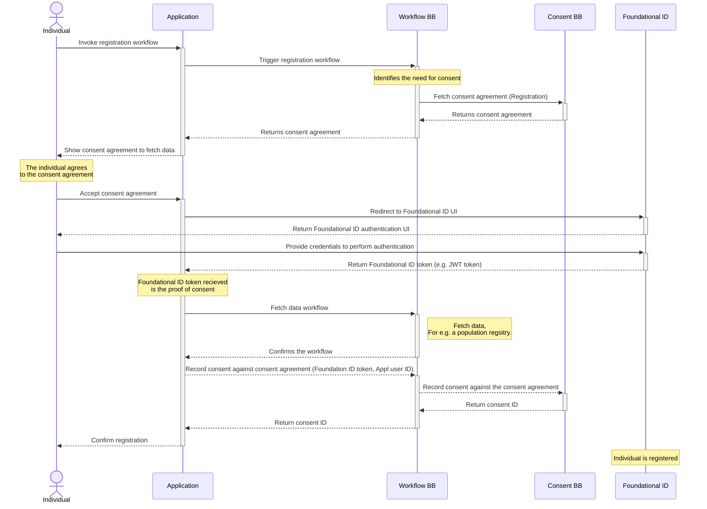

# 9 Workflows


A workflow provides a detailed view of how this building block will interact with other building blocks to support common use cases.

This section lists workflows that this building block must support. Other workflows may be implemented in addition to those listed.

The workflows should provide a name and description as well as a sequence diagram that shows the interactions between actors and various building blocks

_Note: Workflows may be categorized into categories where appropriate_


_\<Example Workflow>_

### Consenting at initial registration (Pre-registration) using a centralised ID system

The first and somewhat unique use-case is related to the need for consent when the Individual is not yet provisioned in the System processing the data. In such cases, the workflow requires the creation of a valid and trusted Foundational ID to be linked with the Consent Record. Below is shown how a pre-registration use of consent workflow works.

